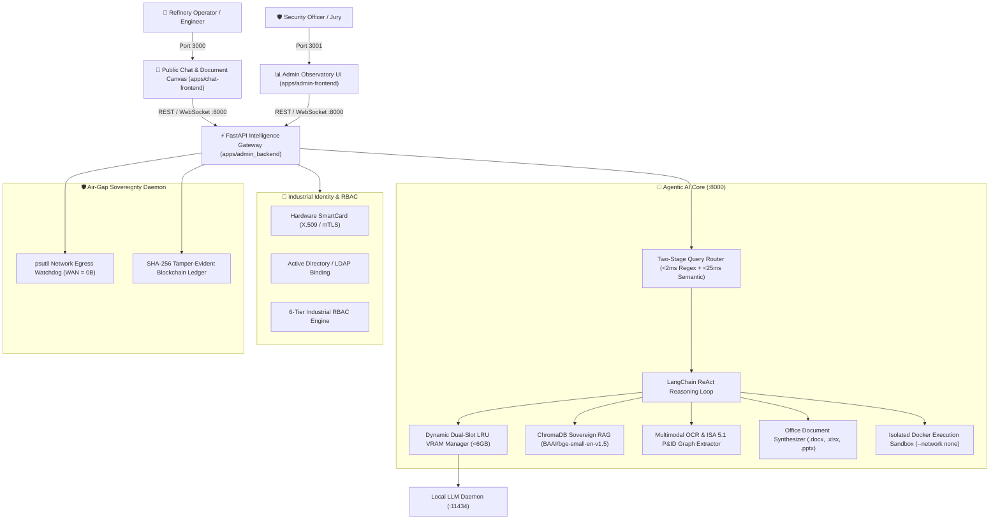

# REVEAL 2.0: MRPL Sovereign AI Workbench (SIH26117)

[](https://www.python.org/)
[](https://fastapi.tiangolo.com/)
[](https://nextjs.org/)
[](https://tailwindcss.com/)
[](https://www.docker.com/)
[](https://ollama.com/)
[]()
[]()

**REVEAL 2.0** is an enterprise defense-grade, **100% air-gapped on-premise agentic AI workbench** engineered for industrial operations at **Mangalore Refinery and Petrochemicals Limited (MRPL — ONGC Group Company)**.

Operating in complete cryptographic isolation with **zero WAN internet egress**, REVEAL 2.0 combines SmartCard PKI authentication, Corporate Active Directory / LDAP integration, multi-model GPU VRAM orchestration ($\le 6.0\text{ GB}$), two-stage query routing, offline RAG over refinery SOPs, automated multi-format deliverable synthesis (Word, Excel, PowerPoint), and isolated Docker code execution.

---

## 🌐 Port Allocation & Service Map

| Service | Port | Local URL | Role / Description |
| :--- | :--- | :--- | :--- |
| **Public Chat & Canvas UI** | `3000` | [`http://localhost:3000/`](http://localhost:3000/) | Executive Chat UI, Document Canvas (UniverJS / Monaco), and Deliverable Explorer |
| **Admin Observatory UI** | `3001` | [`http://localhost:3001/`](http://localhost:3001/) | Real-time System Observatory, VRAM telemetry, RAG manager, and Audit Watchdog |
| **Python Backend Gateway** | `8000` | [`http://localhost:8000/`](http://localhost:8000/) | FastAPI Application, ReAct Agent loop, ChromaDB RAG, and WebSocket streams |
| **Local LLM Daemon** | `11434` | [`http://localhost:11434/`](http://localhost:11434/) | Local Ollama / GGUF model serving engine |

---

## 📑 Table of Contents
1. [Core Features & Architecture](#-core-features--architecture)
2. [Enterprise Security & PKI Authentication](#-enterprise-security--pki-authentication)
3. [Complete Tech Stack](#-complete-tech-stack)
4. [Directory & Repository Structure](#-directory--repository-structure)
5. [Subsystems Deep Dive](#-subsystems-deep-dive)
6. [Prerequisites](#-prerequisites)
7. [Step-by-Step Setup & Running Locally](#-step-by-step-setup--running-locally)
8. [Demo / Fast-Track Evaluation Guide](#-demo--fast-track-evaluation-guide)
9. [Developer Standards & Air-Gap Invariants](#-developer-standards--air-gap-invariants)

---

## 🏛 Core Features & Architecture



---

## 🔐 Enterprise Security & PKI Authentication

REVEAL 2.0 incorporates defense-grade authentication meeting **ISA/IEC 62443** critical infrastructure cybersecurity standards:

1. **Hardware SmartCard PKI (X.509 / mTLS)**:
   - Cryptographic verification against the sovereign **MRPL Plant Root CA**.
   - Real-time CRL (Certificate Revocation List) checking with immediate serial revocation.
   - Built-in `.pem`/`.crt` file upload, interactive card reader simulation, and valid test presets.
2. **Corporate Active Directory / Intranet LDAP**:
   - Secure directory binding with domain mapping (`MRPL.INTERNAL`, `ONGC.CORP`, `REFINERY-WEST.LOCAL`).
   - Automatic `memberOf` group deduction mapping to industrial roles.
3. **6-Tier Industrial Role-Based Access Control (RBAC)**:
   - `SUPER_ADMIN` (Executive HSE, Plant CISO, Full Override)
   - `PLANT_SECURITY_OFFICER` (CRL Management, Tamper Audit, User Governance)
   - `PROCESS_LEAD` (Production Planning, AST Sandbox Override, RAG Ingestion)
   - `MAINTENANCE_ENG` (Equipment P&ID Extraction, Work Order Synthesis)
   - `HSE_AUDITOR` (Safety Compliance, Regulatory Incident Review)
   - `FIELD_OPERATOR` (Real-time Operations, SOP Queries, Incident Logging)
4. **SHA-256 Tamper-Evident Audit Ledger**:
   - Every login event, permission verification, model invocation, and CRL update is appended to a cryptographic hash-chained audit log with local database persistence.

---

## 🛠 Complete Tech Stack

| Domain | Technology | Version | Purpose |
| :--- | :--- | :--- | :--- |
| **Backend Core** | **Python / FastAPI** | `3.11+` / `0.111.0` | Asynchronous REST & WebSocket intelligence gateway |
| **ASGI Server** | **Uvicorn** | `0.30.1` | High-throughput asynchronous server on `0.0.0.0:8000` |
| **Database Layer** | **XAMPP MySQL / PyMySQL** | `8.0+` / `1.1.1` | On-premise relational store for users, RBAC, chat sessions & CRLs |
| **Security Layer** | **Argon2id / OWASP Middleware** | `23.8.0` / Custom | Memory-hard password hashing, sliding-window rate limiting & security headers |
| **Agent Framework** | **LangChain** | `0.2.11` | Strict ReAct reasoning loop with tool execution |
| **Model Runtime** | **Ollama / GGUF** | Latest | Local GPU model serving with dynamic LRU dual-slot swapping |
| **Vector Store** | **ChromaDB** | `0.5.4` | On-premise vector store with source citation attribution |
| **Embeddings** | **Sentence-Transformers** | `3.0.1` | Local `BAAI/bge-small-en-v1.5` embeddings (384-dimensional) |
| **OCR & Vision** | **PaddleOCR / Tesseract** | `2.8.1` / `5.3+` | Multimodal schematic extraction & ISA 5.1 P&ID parsing |
| **Office Automation**| **python-docx / openpyxl / pptx**| `1.1.2` / `3.1.5` / `0.6.23` | Programmatic generation of Word, Excel, and PowerPoint files |
| **Execution Sandbox**| **Docker Engine** | `24.0+` | `python:3.11-slim` container runner with `--network none` |
| **Sovereignty Daemon**| **psutil / Cryptography** | `6.0.0` / `42.0+` | Real-time socket watchdog & X.509 PKI validator |
| **Chat Frontend** | **Next.js 14 / React 18** | `14.2.5` / `18.3.1` | Main conversational interface + UniverJS Document Canvas |
| **Admin Frontend** | **Next.js 14 / React 18** | `14.2.5` / `18.3.1` | 9-Subsystem telemetry observatory dashboard |
| **Styling & UI** | **Tailwind CSS / Lucide** | `3.4.4` / `0.395.0` | Industrial dark aesthetic with "Double-Bezel" hardware chassis |
| **State Management** | **Zustand** | `4.5.4` | High-performance reactive stores for chat, theme, and telemetry |

---

## 📂 Directory & Repository Structure

```text
G:/SIH/p/
├── .gitignore                          # Excludes build caches, logs, node_modules, and models
├── README.md                           # Master documentation & deployment guide
├── package.json                        # Root repository metadata & Prisma scripts
│
├── apps/                               # Application Core
│   ├── chat-frontend/                  # Public Chat Interface & Document Canvas (Port 3000)
│   │   ├── src/
│   │   │   ├── app/
│   │   │   │   ├── login/              # Redesigned Enterprise SmartCard/LDAP Login UI
│   │   │   │   ├── page.tsx            # Main Chat Engine with Perplexity-style reasoning
│   │   │   │   └── globals.css         # Industrial mesh grids & hardware chassis styles
│   │   │   ├── components/
│   │   │   │   ├── canvas/             # UniverJS Sheets, Slides, Docs & Monaco Editor
│   │   │   │   ├── sidebar/            # App sidebar with operator profile & session list
│   │   │   │   └── MarkdownContent.tsx # GFM renderer with syntax highlighting & tables
│   │   │   └── store/                  # Zustand state stores (Chat, Auth with auto-lock, Canvas, Theme)
│   │   ├── package.json                # Next.js scripts ("dev:http": "next dev -p 3000")
│   │   └── server-https.js             # Optional HTTPS server for mobile microphone access
│   │
│   ├── admin-frontend/                 # Admin Observatory Dashboard (Port 3001)
│   │   ├── src/
│   │   │   ├── app/                    # Multi-screen observatory pages (/models, /rag, /ocr, etc.)
│   │   │   ├── components/             # OverviewDeck, VRAM gauges, and Telemetry cards
│   │   │   └── store/                  # Admin stores (Models, Sovereignty, RAG, Network)
│   │   └── package.json                # Next.js scripts ("dev": "next dev -p 3001")
│   │
│   └── admin_backend/                  # Unified FastAPI Gateway (Port 8000)
│       ├── main.py                     # Entry point, 100% offline env setup, OWASP middleware & router mounts
│       ├── requirements.txt            # Python backend dependencies
│       ├── api/                        # Route handlers (auth, chat, files, models, ocr, rag, sandbox)
│       ├── core/                       # Enterprise auth manager, XAMPP MySQL backend, PKI validator & RBAC engine
│       │   ├── auth_manager.py         # PyMySQL repository, Argon2id hasher & session manager
│       │   └── security_middleware.py  # Rate limiter (DDoS shield), path sanitizers & security headers
│       ├── agent/                      # LangChain ReAct reasoning loop & tool definitions
│       ├── models/                     # Dual-slot LRU VRAM memory manager & compute backends
│       ├── rag/                        # ChromaDB ingestion, retrieval & citation linking
│       ├── ocr/                        # PaddleOCR / Tesseract pipeline & P&ID graph extraction
│       ├── sovereignty/                # Network socket inspector & SHA-256 tamper-evident log
│       └── config/                     # auth_config.yaml (MySQL), hardware_profiles.yaml, models.yaml
│
├── data/                               # Air-Gapped Persistent Storage
│   ├── chroma_db/                      # Embedded ChromaDB vector indices
│   ├── mrpl_documents/                 # Refinery SOPs, safety guidelines & CSB reports
│   ├── uploads/                        # User-uploaded documents and P&ID drawings
│   └── outputs/                        # Programmatically generated Word, Excel & PPTX files
│
└── scripts/                            # Operational & Setup Scripts
    └── download_and_verify_models.py   # Air-gap model verification script
```

---

## 🔍 Subsystems Deep Dive

### 1. Dual-Slot LRU VRAM Memory Manager
Allows hosting multiple specialized LLMs (General Agent, Math/Code, Safety RAG, Vision) on consumer workstations with **$\le 6.0\text{ GB}$ VRAM**:
* **Slot 1**: Fixed lightweight embeddings model (`BAAI/bge-small-en-v1.5`, ~130MB).
* **Slot 2**: Dynamic single-model execution slot with automated LRU unload/load cycles.

### 2. Two-Stage Query Router
* **Stage 1 (Regex Classifier, $<2\text{ms}$)**: Instant pattern matching for direct calculations, unit conversions, and standard deliverable requests.
* **Stage 2 (Semantic Vector Router, $<25\text{ms}$)**: High-accuracy intent categorization routing to Domain RAG, Code Sandbox, or Direct Synthesis.

### 3. In-Browser Document Canvas Panel
Provides live interactive editing and preview for synthesized outputs:
* **UniverJS Sheets**: Interactive spreadsheets with formula calculation and chart rendering.
* **UniverJS Docs & Slides**: Rich text document inspection and slide decks.
* **Monaco Code Editor**: Real-time syntax highlighting for generated Python/SQL scripts.

### 4. Multimodal OCR & P&ID Tag Extraction
* Offline extraction of text from scanned engineering drawings, PDF manuals, and P&ID piping diagrams.
* Detects ISA 5.1 instrumentation tags (`FT-101`, `PT-202`, `XV-301`) and builds an interactive topological connection graph.

---

## ⚡ Prerequisites

1. **Operating System:** Windows 10/11 (64-bit) or Ubuntu 22.04 LTS
2. **Python:** Version `3.11.x` or `3.12.x`
3. **Node.js:** Version `18.x` or `20.x` (`node -v`)
4. **Ollama:** Installed and running locally ([ollama.com](https://ollama.com/))
5. **Docker Desktop:** (Optional) for sandboxed Python code execution

---

## 🚀 Step-by-Step Setup & Running Locally

### Step 1: Clone Repository
```bash
git clone https://github.com/Deepak0205p/hackbusters-devlopment.git
cd hackbusters-devlopment
```

---

### Step 2: Start Python Backend (Port 8000)
```bash
# Windows (PowerShell)
$env:PYTHONPATH = "G:\SIH\p"
python -m uvicorn apps.admin_backend.main:app --host 0.0.0.0 --port 8000 --reload

# Linux / macOS
export PYTHONPATH="."
python3 -m uvicorn apps.admin_backend.main:app --host 0.0.0.0 --port 8000 --reload
```
👉 Backend API Docs: **`http://localhost:8000/api/docs`**

---

### Step 3: Run Public Chat Frontend (Port 3000)
In a new terminal:
```bash
cd apps/chat-frontend
npm.cmd install    # (or npm install)
npm.cmd run dev:http
```
👉 Access Public Chat UI: **`http://localhost:3000`**

---

### Step 4: Run Admin Observatory Frontend (Port 3001)
In a new terminal:
```bash
cd apps/admin-frontend
npm.cmd install    # (or npm install)
npm.cmd run dev
```
👉 Access Admin Observatory: **`http://localhost:3001`**

---

## 🎯 Demo / Fast-Track Evaluation Guide

When presenting to evaluators or juries, navigate to **`http://localhost:3000/login`**:

1. **Option A: SmartCard PKI (Recommended for Demo)**
   - Click the **SmartCard** tab.
   - Click **"Load Sample Card"** to auto-load a valid X.509 certificate signed by the MRPL Plant Root CA (`Rajesh Kumar - Executive HSE & Audit`).
   - Click **Authenticate via SmartCard PKI**.
2. **Option B: Corporate LDAP / Active Directory**
   - Click the **LDAP / AD** tab.
   - Click **"Fill Default User"** (`operator` / `RefineryPass2026!`).
   - Click **Sign in via Corporate LDAP**.
3. **Option C: 1-Click Fast-Track**
   - Click the **Fast-Track** tab.
   - Click **Lead Process Operator** (`FIELD_OP`) or **Refinery Compliance Chief** (`SUPER_ADMIN`) to sign in instantly.

---

## 🛡 Developer Standards & Air-Gap Invariants

1. **Zero External Telemetry Invariant:**
   - No runtime calls to OpenAI, Anthropic, Gemini, Azure, or remote analytics.
   - `HF_HUB_OFFLINE=1` and `CHROMA_TELEMETRY=False` are strictly enforced at startup.
2. **Port Separation Invariant:**
   - **Port 3000:** Public Chat & Canvas Interface
   - **Port 3001:** Admin Observatory Dashboard
   - **Port 8000:** FastAPI Intelligence Gateway
   - **Port 11434:** Ollama / Local Model Daemon
3. **Clean Git Hygiene:**
   - Exclude `.next/`, `node_modules/`, `*.tsbuildinfo`, `*.db-wal`, `__pycache__/`, and `.env` files.

---

**MRPL Sovereign AI Workbench — SIH26117**  
*Mangalore Refinery and Petrochemicals Limited (ONGC Group Company)*
