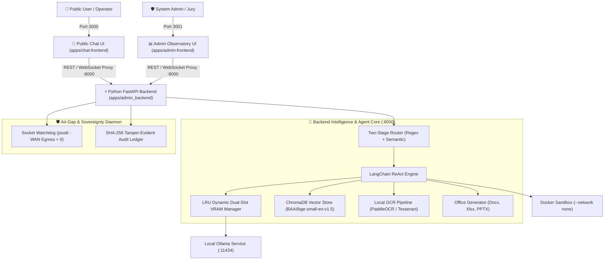

# HackBuster: Sovereign On-Premise Agentic AI Workbench (SIH26117)

[](https://www.python.org/)
[](https://fastapi.tiangolo.com/)
[](https://nextjs.org/)
[](https://tailwindcss.com/)
[](https://www.docker.com/)
[](https://ollama.com/)
[]()

An enterprise-grade, **100% air-gapped, on-premise agentic AI workstation** built for industrial operations (e.g., MRPL / ONGC / critical infrastructure). It runs completely offline on standard hardware ($\le 6.0\text{ GB}$ VRAM) with zero external internet egress.

---

## 🌐 Port Allocation & Access Rules (Fixed Standard)

| Service | Port | Local URL | Role |
| :--- | :--- | :--- | :--- |
| **Public Chat UI** | `3000` | [`http://localhost:3000/`](http://localhost:3000/) | Next.js Chat Frontend (Client interaction) |
| **Admin Observatory UI** | `3001` | [`http://localhost:3001/`](http://localhost:3001/) | Next.js Admin Dashboard (Telemetry & Hardware Observatory) |
| **Python Backend Gateway** | `8000` | [`http://localhost:8000/`](http://localhost:8000/) | FastAPI Application, Agent loop, RAG & WebSocket APIs |
| **Local LLM Engine** | `11434` | [`http://localhost:11434/`](http://localhost:11434/) | Ollama Daemon |

---

## 📑 Table of Contents
1. [Architecture Overview](#-architecture-overview)
2. [Complete Tech Stack](#-complete-tech-stack)
3. [Project Directory & File Structure](#-project-directory--file-structure)
4. [Folder-by-Folder Guide](#-folder-by-folder-guide)
5. [Prerequisites](#-prerequisites)
6. [Step-by-Step Setup & How to Run](#-step-by-step-setup--how-to-run)
7. [Developer Guidelines & Contribution Workflow](#-developer-guidelines--contribution-workflow)

---

## 🏛 Architecture Overview



---

## 🛠 Complete Tech Stack

| Domain | Technology / Library | Version | Description / Role |
| :--- | :--- | :--- | :--- |
| **Backend Framework** | **Python / FastAPI** | `3.11` / `0.111.0` | Asynchronous API, WebSocket streaming & agent gateway |
| **ASGI Server** | **Uvicorn** | `0.30.1` | ASGI server running backend on `0.0.0.0:8000` |
| **Agent Framework** | **LangChain** | `0.2.11` | Strict ReAct (Reason + Act) loop execution |
| **Model Runtime** | **Ollama** | Latest | Local GGUF open-weight model serving & dynamic VRAM swapping |
| **Vector DB & RAG** | **ChromaDB** | `0.5.4` | Embedded local vector store in `data/chroma_db/` |
| **Embeddings** | **Sentence-Transformers** | `3.0.1` | Local `BAAI/bge-small-en-v1.5` embeddings (384-dim) |
| **OCR & Parsing** | **PaddleOCR / Tesseract** | `2.8.1` / `5.3+` | Offline multimodal document and P&ID schematic parsing |
| **Deliverables** | **python-docx / openpyxl / pptx**| `1.1.2` / `3.1.5` / `0.6.23`| Auto-generates `.docx`, `.xlsx`, and `.pptx` documents |
| **Execution Sandbox** | **Docker Engine** | `24.0+` | `python:3.11-slim` container with `--network none` |
| **Sovereignty Daemon**| **psutil** | `6.0.0` | Real-time network socket auditor & SHA-256 audit ledger |
| **Chat Frontend** | **Next.js 14 (Port 3000)** | `14.2.5` | End-user conversational interface |
| **Admin Frontend** | **Next.js 14 (Port 3001)** | `14.2.5` | Real-time system observatory dashboard |
| **Styling & Icons** | **Tailwind CSS / Lucide** | `3.4.4` / `0.395.0` | Dark industrial design theme (`#020617`, `#0f172a`, emerald/amber) |
| **State Management** | **Zustand** | `4.5.4` | In-memory reactive state stores (Chat, Model, Sovereignty) |

---

## 📂 Project Directory & File Structure

```text
G:/SIH/p/
├── .gitignore                          # Excludes node_modules, build artifacts, logs & envs
├── README.md                           # Master project guide for developers & setup
├── AGENT.md                            # Binding operational and engineering rules for AI/devs
│
├── apps/                               # Application Core Layer
│   ├── chat-frontend/                  # Public Conversational Chat Interface (Port 3000)
│   │   ├── src/                        # React components, pages & Zustand stores
│   │   ├── package.json                # Scripts: "dev": "next dev -p 3000"
│   │   └── next.config.mjs             # Next.js configuration & API proxying
│   │
│   ├── admin-frontend/                 # Admin Observatory Dashboard (Port 3001)
│   │   ├── src/                        # 6-Screen observatory components & live charts
│   │   ├── package.json                # Scripts: "dev": "next dev -p 3001"
│   │   └── next.config.mjs             # Next.js configuration
│   │
│   └── admin_backend/                  # Unified FastAPI Gateway (Port 8000)
│       ├── main.py                     # App entry point, CORS, WebSockets & APIs
│       ├── requirements.txt            # Python dependencies
│       ├── config/                     # Settings & environment configurations
│       ├── models/                     # Dual-slot LRU VRAM memory manager & Ollama client
│       ├── core/                       # Two-stage query routing engine (Regex + Semantic)
│       ├── agent/                      # LangChain ReAct reasoning loop & tool orchestrator
│       ├── rag/                        # ChromaDB ingestion, retrieval & citation linking
│       ├── ocr/                        # PaddleOCR / Tesseract PDF & CAD schematic pipeline
│       ├── deliverables/               # Word (.docx), Excel (.xlsx), and PPTX generators
│       ├── sovereignty/                # Socket watchdog & SHA-256 tamper-evident log
│       ├── api/                        # REST & WebSocket route handlers
│       └── tests/                      # Unit & integration regression test suites
│
├── data/                               # Air-Gapped Persistent Data Storage
│   ├── chroma_db/                      # ChromaDB SQLite & vector index files
│   ├── annual_reports/                 # Industrial annual reports (ONGC, MRPL, etc.)
│   ├── mrpl_documents/                 # Safety policies, CSB reports, and refinery SOPs
│   ├── ongc_policies/                  # Corporate governance & procurement guidelines
│   ├── sample_inputs/                  # Inspection PDFs & CAD/P&ID engineering drawings
│   └── outputs/                        # Generated Word/Excel/PPTX deliverable files
│
├── docs/                               # System Specs, PRD & Evaluation Runbooks
│   ├── PRD.md                          # Product Requirements Document & statutory mappings
│   ├── architecture.md                 # System architecture & memory topologies
│   ├── tech_stack.md                   # Locked technology stack specifications
│   ├── file_structure.md               # Detailed directory topology
│   ├── DEMO_DAY_RUNBOOK.md             # 10-Minute live jury presentation script
│   └── tasks.md                        # Milestone & subtask progress tracker
│
├── models/                             # Declarative Model Configurations
│   └── models.yaml                     # YAML schema defining VRAM limits, roles & GGUF weights
│
├── sandbox/                            # Ephemeral volume mount for Docker container executions
└── scripts/                            # Automation, environment check & hotspot setup scripts
```

---

## 🔍 Folder-by-Folder Guide

### 1. `apps/chat-frontend/` (Port 3000)
- **Role:** The primary end-user conversational interaction interface.
- **Port:** Runs on **`http://localhost:3000/`**
- **Key Modules:**
  - `src/components/chat/`: Message bubbles, streaming markdown renderer, tool execution cards.
  - `src/components/deliverables/`: In-browser preview & download cards for `.docx`, `.xlsx`, and `.pptx`.
  - `src/store/useChatStore.ts`: Manages chat history, active websocket stream, and UI state.

### 2. `apps/admin-frontend/` (Port 3001)
- **Role:** Operator & Jury technical observatory showing real-time under-the-hood engine state.
- **Port:** Runs on **`http://localhost:3001/`**
- **Key Screens:**
  1. **VRAM Status Panel:** Live dual-slot VRAM memory gauges & LRU swapping metrics.
  2. **Code Sandbox Monitor:** Real-time Docker AST execution logs and resource caps.
  3. **Multimodal Ingestion Hub:** OCR extraction logs, P&ID tag detections, and bounding boxes.
  4. **Network Sovereignty Terminal:** Real-time socket watchdog showing **0 WAN egress** and SHA-256 hash chains.
  5. **Model Registry Manager:** Inspect and hot-reload `models.yaml`.
  6. **Jury Connect:** Live QR code generator for multi-device LAN/Hotspot pairing.

### 3. `apps/admin_backend/` (Port 8000)
- **Role:** Single unified Python FastAPI server hosting the intelligence loop, agent tools, RAG, and APIs.
- **Port:** Runs on **`http://localhost:8000/`**
- **Key Sub-packages:**
  - `models/`: Manages model swapping in GPU memory so VRAM never exceeds 6.0 GB.
  - `core/`: Routes user queries (Direct Chat vs RAG Search vs Python Calculation vs Deliverable Synthesis).
  - `agent/`: LangChain ReAct agent executing thoughts, actions, and observations.
  - `rag/`: Queries ChromaDB embeddings with strict source citation matching.
  - `ocr/`: Offline PaddleOCR and Tesseract document extraction.
  - `deliverables/`: Templated programmatic generation of Word documents, spreadsheets, and slides.
  - `sovereignty/`: Background socket watchdog auditing network interfaces to prove 100% air-gap compliance.

### 4. `data/` (Air-Gapped Data Repository)
- Holds all persistent offline assets: pre-indexed ChromaDB embeddings, refinery SOPs, annual reports, test blueprints, and generated outputs.

---

## ⚡ Prerequisites

Before running the project, ensure your workstation has:
1. **OS:** Windows 10/11 (64-bit) or Ubuntu 22.04 LTS
2. **Python:** Version `3.11.x` (`python --version`)
3. **Node.js:** Version `18.x` or `20.x` with `npm` (`node -v`)
4. **Ollama:** Installed and running locally ([ollama.ai](https://ollama.ai/))
5. **Docker Engine / Desktop:** Running for sandboxed Python code execution

---

## 🚀 Step-by-Step Setup & How to Run

### Step 1: Clone Repository
```bash
git clone https://github.com/Deepak0205p/hackbusters-devlopment.git
cd hackbusters-devlopment
```

---

### Step 2: Set Up Python Backend (Port 8000)

```bash
# Windows (PowerShell)
python -m venv venv
.\venv\Scripts\Activate.ps1

# Linux / macOS
python3 -m venv venv
source venv/bin/activate

# Install backend dependencies
pip install -r apps/admin_backend/requirements.txt

# Run FastAPI Backend Server
python -m uvicorn apps.admin_backend.main:app --host 0.0.0.0 --port 8000 --reload
```

---

### Step 3: Start Ollama Local Service (Port 11434)

1. Start the Ollama daemon:
   ```bash
   ollama serve
   ```
2. Verify models from `models/models.yaml` are loaded:
   ```bash
   ollama list
   ```

---

### Step 4: Run Public Chat Frontend (Port 3000)

In a new terminal window:
```bash
cd apps/chat-frontend
npm install
npm run dev
```
👉 Open **`http://localhost:3000`** in your browser.

---

### Step 5: Run Admin Observatory Frontend (Port 3001)

In another new terminal window:
```bash
cd apps/admin-frontend
npm install
npm run dev
```
👉 Open **`http://localhost:3001`** in your browser.

---

## 🤝 Developer Guidelines & Contribution Workflow

1. **Port Separation Invariant:**
   - Public Chat: **Port 3000**
   - Admin Observatory: **Port 3001**
   - Python Backend: **Port 8000**
2. **Zero External API Calls at Runtime:** Never add imports or calls to remote AI APIs (OpenAI, Anthropic, Gemini API, Azure). All intelligence must run via local Ollama or local embedded models.
3. **Strict Folder Boundary:**
   - Python code belongs strictly in `apps/admin_backend/`.
   - React/TypeScript code belongs strictly in `apps/chat-frontend/` or `apps/admin-frontend/`.
4. **Commit Clean Code:** Do not commit `node_modules`, `.next/`, or `.env` files.
