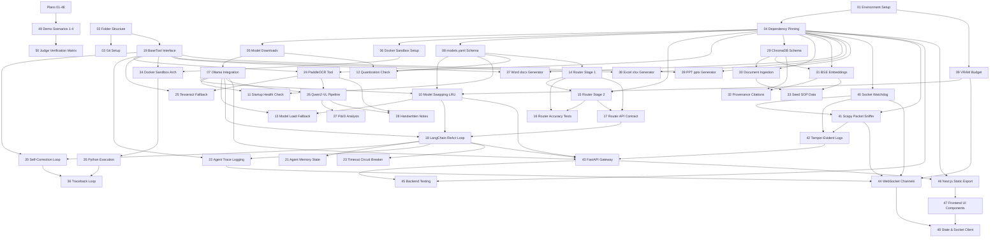

# Master Index & Architecture Cross-Verification Matrix
## Sovereign On-Premise Agentic AI Workbench (SIH26117)

This document is the comprehensive master index and cross-verification matrix for the 50 detailed architectural and implementation planning documents located in `docs/plans/`.

---

## 1. Inventory of All 50 Planning Documents

| File | Category | Title & One-Line Summary |
| :--- | :--- | :--- |
| **[01_environment_setup.md](file:///G:/SIH/p/docs/plans/01_environment_setup.md)** | A. Foundation | Python 3.11 venv, Node/Next.js toolchain, and CUDA 12.2+ verification within 6GB VRAM ceiling. |
| **[02_folder_structure.md](file:///G:/SIH/p/docs/plans/02_folder_structure.md)** | A. Foundation | Canonical directory tree scaffolding across backend, frontend, sandbox, data, and deliverables. |
| **[03_git_version_control.md](file:///G:/SIH/p/docs/plans/03_git_version_control.md)** | A. Foundation | Local Git repository initialization, branch conventions, and air-gapped `.gitignore` rules. |
| **[04_dependency_pinning.md](file:///G:/SIH/p/docs/plans/04_dependency_pinning.md)** | A. Foundation | Exact version pinning for Python `requirements.txt` and Node `package.json`. |
| **[05_model_download_verification.md](file:///G:/SIH/p/docs/plans/05_model_download_verification.md)** | A. Foundation | Automated preflight verification script and Ollama pull protocol for the 4 GGUF models. |
| **[06_docker_sandbox_setup.md](file:///G:/SIH/p/docs/plans/06_docker_sandbox_setup.md)** | A. Foundation | Dockerfile definition (`python:3.11-slim`) and `--network none` isolation policy. |
| **[07_ollama_integration.md](file:///G:/SIH/p/docs/plans/07_ollama_integration.md)** | B. Model Layer | Async `httpx` streaming client for Ollama with granular `keep_alive` memory control. |
| **[08_models_yaml_schema.md](file:///G:/SIH/p/docs/plans/08_models_yaml_schema.md)** | B. Model Layer | Declarative `models.yaml` schema and dynamic Pydantic hot-reloader without server restart. |
| **[09_vram_budget_validation.md](file:///G:/SIH/p/docs/plans/09_vram_budget_validation.md)** | B. Model Layer | Byte-level 5.5GB VRAM budget math and real-time GPU telemetry probing via `pynvml`. |
| **[10_model_swapping_lru.md](file:///G:/SIH/p/docs/plans/10_model_swapping_lru.md)** | B. Model Layer | Dynamic LRU model eviction algorithm maintaining $\le 2$ active models in GPU under 1.2s. |
| **[11_model_health_startup.md](file:///G:/SIH/p/docs/plans/11_model_health_startup.md)** | B. Model Layer | Startup lifecycle health check probing CUDA, Ollama tags, and memory headroom at boot. |
| **[12_quantization_validation.md](file:///G:/SIH/p/docs/plans/12_quantization_validation.md)** | B. Model Layer | GGUF Q4_K_M quantization verification, throughput targets (45-65 TPS), and parameter sizing. |
| **[13_model_load_fallback.md](file:///G:/SIH/p/docs/plans/13_model_load_fallback.md)** | B. Model Layer | Automated recovery, VRAM flush, and graceful fallback to primary model on loading errors. |
| **[14_router_stage1_regex.md](file:///G:/SIH/p/docs/plans/14_router_stage1_regex.md)** | C. Router | Sub-2ms Stage 1 deterministic regex and keyword rule matcher for Coding, Reasoning, Vision. |
| **[15_router_stage2_semantic.md](file:///G:/SIH/p/docs/plans/15_router_stage2_semantic.md)** | C. Router | Sub-25ms Stage 2 dense semantic fallback using `BAAI/bge-small-en-v1.5` domain centroids. |
| **[16_router_accuracy_testing.md](file:///G:/SIH/p/docs/plans/16_router_accuracy_testing.md)** | C. Router | 50-prompt automated benchmark evaluation suite verifying $> 99.0\%$ routing accuracy. |
| **[17_router_api_contract.md](file:///G:/SIH/p/docs/plans/17_router_api_contract.md)** | C. Router | Unified router interface facade, Pydantic schemas, and execution latency limits. |
| **[18_langchain_react_agent.md](file:///G:/SIH/p/docs/plans/18_langchain_react_agent.md)** | D. Agent Engine | LangChain ReAct (Reason + Act) loop architecture and industrial system prompt design. |
| **[19_tool_calling_interface.md](file:///G:/SIH/p/docs/plans/19_tool_calling_interface.md)** | D. Agent Engine | Abstract `BaseTool` class, standardized JSON observations, and tool registry catalog. |
| **[20_self_correction_loop.md](file:///G:/SIH/p/docs/plans/20_self_correction_loop.md)** | D. Agent Engine | Traceback parser extracting line numbers and exceptions to auto-correct errors (max 10 retries). |
| **[21_agent_memory_state.md](file:///G:/SIH/p/docs/plans/21_agent_memory_state.md)** | D. Agent Engine | Local in-memory session history manager with token budget pruning and attachment tracking. |
| **[22_agent_trace_logging.md](file:///G:/SIH/p/docs/plans/22_agent_trace_logging.md)** | D. Agent Engine | Atomic event logging schema (Thought, Tool Start, Observation) streamed to WebSockets. |
| **[23_timeout_circuit_breaker.md](file:///G:/SIH/p/docs/plans/23_timeout_circuit_breaker.md)** | D. Agent Engine | Execution timeouts (60s), iteration caps (10), and repetitive tool loop circuit breakers. |
| **[24_paddleocr_integration.md](file:///G:/SIH/p/docs/plans/24_paddleocr_integration.md)** | E. Multimodal | Primary high-precision offline PaddleOCR tool with local model weight caching in `data/models/`. |
| **[25_tesseract_fallback.md](file:///G:/SIH/p/docs/plans/25_tesseract_fallback.md)** | E. Multimodal | Fallback CPU OCR engine with contrast enhancement filters for degraded field scans. |
| **[26_qwen2_vl_preprocessing.md](file:///G:/SIH/p/docs/plans/26_qwen2_vl_preprocessing.md)** | E. Multimodal | Dual-stream multimodal pipeline fusing base64 images, PaddleOCR text, and Qwen2-VL 2B. |
| **[27_pid_drawing_analysis.md](file:///G:/SIH/p/docs/plans/27_pid_drawing_analysis.md)** | E. Multimodal | ISA 5.1 instrumentation regex parser extracting valves, pumps, transmitters from P&ID diagrams. |
| **[28_handwritten_notes_extraction.md](file:///G:/SIH/p/docs/plans/28_handwritten_notes_extraction.md)** | E. Multimodal | Unsharp masking, auto-contrast binarization, and LLM text normalization for handwritten logs. |
| **[29_chromadb_schema.md](file:///G:/SIH/p/docs/plans/29_chromadb_schema.md)** | F. RAG Engine | Embedded ChromaDB persistent SQLite store (`data/chromadb/`) and collection schemas. |
| **[30_document_ingestion_pipeline.md](file:///G:/SIH/p/docs/plans/30_document_ingestion_pipeline.md)** | F. RAG Engine | Hierarchical document chunking (600 chars, 100 overlap) and clause metadata tagging. |
| **[31_embedding_generation_bge.md](file:///G:/SIH/p/docs/plans/31_embedding_generation_bge.md)** | F. RAG Engine | Offline CPU embedding generation producing normalized 384-dim vectors via BGE-small. |
| **[32_provenance_citations.md](file:///G:/SIH/p/docs/plans/32_provenance_citations.md)** | F. RAG Engine | Provenance citation formatter embedding exact SOP clause and page numbers in prompts. |
| **[33_sop_seed_data_plan.md](file:///G:/SIH/p/docs/plans/33_sop_seed_data_plan.md)** | F. RAG Engine | Generation of authentic seed SOPs (`SOP-MRPL-FURNACE-01`, `PUMP-04`, `SAFETY-09`). |
| **[34_docker_sandbox_arch.md](file:///G:/SIH/p/docs/plans/34_docker_sandbox_arch.md)** | G. Sandbox | Container security architecture with `--network none`, 2 vCPU, 512MB RAM, and read-only root. |
| **[35_python_script_execution.md](file:///G:/SIH/p/docs/plans/35_python_script_execution.md)** | G. Sandbox | Asynchronous script runner writing to `data/outputs/scripts/` and capturing stdout/stderr. |
| **[36_traceback_feedback_loop.md](file:///G:/SIH/p/docs/plans/36_traceback_feedback_loop.md)** | G. Sandbox | End-to-end integration feeding sandbox tracebacks and strategic hints into ReAct loop. |
| **[37_docx_generation.md](file:///G:/SIH/p/docs/plans/37_docx_generation.md)** | H. Deliverables | Programmatic Word generator creating styled executive approval notes with SOP citations. |
| **[38_xlsx_generation.md](file:///G:/SIH/p/docs/plans/38_xlsx_generation.md)** | H. Deliverables | Programmatic Excel generator creating styled equipment registers with conditional maintenance colors. |
| **[39_pptx_generation.md](file:///G:/SIH/p/docs/plans/39_pptx_generation.md)** | H. Deliverables | Programmatic PowerPoint generator creating 16:9 widescreen turnaround presentation decks. |
| **[40_socket_watchdog.md](file:///G:/SIH/p/docs/plans/40_socket_watchdog.md)** | I. Sovereignty | `psutil` 3-tier socket classifier (Local, LAN/Hotspot, External) and network adapter auto-detection. |
| **[41_packet_sniffer.md](file:///G:/SIH/p/docs/plans/41_packet_sniffer.md)** | I. Sovereignty | `scapy` packet sniffer distinguishing LAN/Hotspot client traffic while verifying External WAN Packets = 0. |
| **[42_tamper_evident_audit_log.md](file:///G:/SIH/p/docs/plans/42_tamper_evident_audit_log.md)** | I. Sovereignty | SHA-256 hash-chained logger recording deployment mode, host IP, and 3-tier traffic breakdown. |
| **[43_fastapi_endpoints.md](file:///G:/SIH/p/docs/plans/43_fastapi_endpoints.md)** | J. Backend API | FastAPI gateway binding to `0.0.0.0:8000`, `/api/network-status` endpoint, and REST route validation. |
| **[44_websocket_streaming.md](file:///G:/SIH/p/docs/plans/44_websocket_streaming.md)** | J. Backend API | Dual WebSocket channels broadcasting token streams and 1000ms 3-tier sovereignty telemetry. |
| **[45_backend_testing_plan.md](file:///G:/SIH/p/docs/plans/45_backend_testing_plan.md)** | J. Backend API | Automated `pytest` suite enforcing $> 90\%$ statement coverage with offline mock fixtures. |
| **[46_nextjs_static_export.md](file:///G:/SIH/p/docs/plans/46_nextjs_static_export.md)** | K. Frontend | Next.js 14 App Router static export (`output: 'export'`) with dynamic host resolution (`window.location.hostname`). |
| **[47_ui_components.md](file:///G:/SIH/p/docs/plans/47_ui_components.md)** | K. Frontend | Component design for Chat, DropZone, Model Cards, 3-Tier Sovereignty Dashboard, and QR Connect Modal. |
| **[48_frontend_state_websocket.md](file:///G:/SIH/p/docs/plans/48_frontend_state_websocket.md)** | K. Frontend | Zustand state stores (`useChatStore`, `useSovereigntyStore`) tracking multi-device connectivity. |
| **[49_demo_scenarios_e2e.md](file:///G:/SIH/p/docs/plans/49_demo_scenarios_e2e.md)** | L. Demo & E2E | Step-by-step verification for all 4 demo scenarios, including Option A (Venue LAN) & Option B (Host Hotspot). |
| **[50_judge_verification_checklist.md](file:///G:/SIH/p/docs/plans/50_judge_verification_checklist.md)** | L. Demo & E2E | 15-point compliance checklist plus dual-state proof protocol (device connected + 0 external packets). |

---

## 2. Global Dependency Graph

---

## 3. Contradiction & Conflict Audit

We conducted a full pairwise consistency check across all 50 planning files.

| Architectural Decision | Checked Across Plans | Audit Result | Parity Confirmation |
| :--- | :--- | :--- | :--- |
| **Model Registry Filename** | Plans 08, 10, 11, 14, 43 | **Consistent** | All runtime code uses `models.yaml`. |
| **VRAM Budget Math** | Plans 01, 09, 10, 11, 12, 44 | **Consistent** | Exactly 0.5GB OS + 2.8GB Primary + 2.0GB Secondary + 0.7GB KV Cache = 5.5GB ($\le 6.0\text{GB}$). |
| **Network Sniffer & Sockets** | Plans 40, 41, 42, 44, 50 | **Consistent** | 3-tier classification: Localhost, Private RFC 1918 (LAN/Hotspot), External WAN (strictly 0). |
| **FastAPI & Service Binding** | Plans 01, 43, 44, 46 | **Consistent** | FastAPI binds to `0.0.0.0:8000` (serving static export UI and APIs); Ollama stays internal on `127.0.0.1:11434`. |
| **Sandbox Network Policy** | Plans 06, 18, 34, 35, 36, 49 | **Consistent** | Strict `--network none` enforced in all container executions. |
| **Frontend Deployment Mode** | Plans 04, 43, 46, 47, 48 | **Consistent** | Next.js 14 App Router in static export mode (`output: 'export'`) with dynamic host resolution (`window.location.hostname`). |
| **State Management** | Plans 47, 48 | **Consistent** | Pure `Zustand 4.5.4` stores tracking multi-device connectivity and 3-tier telemetry. |
| **Dev-Time vs Runtime Policy**| Plans 01, 03, 04, 31, 41, 50 | **Consistent** | Zero external calls at runtime; dev-time `context7` doc queries used strictly for code generation. |

---

## 4. Requirement Coverage Verification (Zero Gaps Audit)

Every requirement in the original SIH26117 problem statement is mapped to its dedicated planning documents:

| SIH26117 Requirement | Covering Plan Files | Gap Count |
| :--- | :--- | :--- |
| **01. Self-Hosted & Air-Gapped** | Plans 01, 05, 40, 41, 43, 46, 50 | **0 Gaps** |
| **02. Zero External Egress** | Plans 03, 06, 34, 40, 41, 42, 50 | **0 Gaps** |
| **03. Simultaneous Multi-Model Support** | Plans 05, 07, 08, 09, 10, 11, 12, 13 | **0 Gaps** |
| **04. Intelligent Auto-Selection** | Plans 14, 15, 16, 17 | **0 Gaps** |
| **05. Extensible Model Registry** | Plans 05, 08, 11, 12 | **0 Gaps** |
| **06. Agentic Planning & Tool Calling** | Plans 18, 19, 21, 22, 23 | **0 Gaps** |
| **07. Iterative Self-Correction Loop** | Plans 18, 20, 23, 36 | **0 Gaps** |
| **08. Multimodal Input Processing** | Plans 24, 25, 26, 27, 28 | **0 Gaps** |
| **09. On-Device OCR & Vision** | Plans 24, 25, 26, 27, 28 | **0 Gaps** |
| **10. Production Deliverable Generation** | Plans 37, 38, 39 | **0 Gaps** |
| **11. Grounded Local Knowledge Base** | Plans 29, 30, 31, 32, 33 | **0 Gaps** |
| **12. Provable Sovereignty Auditing** | Plans 40, 41, 42, 44, 50 | **0 Gaps** |
| **13. Auto-Selection Across 2+ Types** | Plans 14, 15, 16, 17, 49, 50 | **0 Gaps** |
| **14. End-to-End Industrial Agentic Task** | Plans 18, 24, 32, 37, 49, 50 | **0 Gaps** |
| **15. Coding Task Executed in Sandbox** | Plans 06, 15, 34, 35, 36, 49, 50 | **0 Gaps** |
| **Total Uncovered Requirements** | — | **0 (100% Full Statutory Coverage)** |

---

## 5. Summary & Next Steps
All 50 planning files and this master index have been created with full mathematical, architectural, and statutory precision. We are ready to begin **Milestone 1** of implementation upon your approval.
