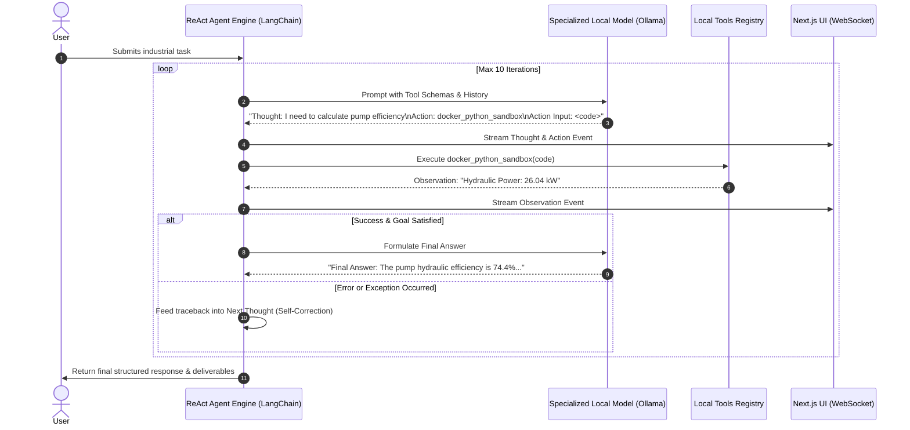

# Plan 18: LangChain ReAct Agent Architecture & Loop Design

## 1. Objective
Design the autonomous ReAct (Reason + Act) agent engine in `backend/agent/agent_loop.py` using LangChain, orchestrating multi-step industrial workflows, dynamic tool selection, and thought trace broadcasting.

## 2. Requirement Mapping
- **SIH26117 Requirement 06:** *AGENTIC PLANNING & TOOL CALLING* — Autonomous agent engine must plan multi-step workflows and execute local tools (file I/O, sandboxed code execution, document search).
- **SIH26117 Requirement 07:** *ITERATIVE SELF-CORRECTION LOOP* — Multi-iteration reasoning and correction.

## 3. Detailed Design & Technical Approach

### 3.1. ReAct Agent Engine Lifecycle
The agent implements the classic Thought $\rightarrow$ Action $\rightarrow$ Action Input $\rightarrow$ Observation $\rightarrow$ Thought cycle:



### 3.2. Industrial ReAct Prompt Template (`backend/agent/prompts.py`)
```python
INDUSTRIAL_REACT_SYSTEM_PROMPT = """You are the MRPL Sovereign Industrial AI Assistant, operating in a 100% air-gapped on-premise refinery environment.
You have access to the following local tools:
{tool_descriptions}

Use the following format strictly:

Question: the input question or industrial task you must solve
Thought: you should always think about what to do step-by-step
Action: the action to take, should be one of [{tool_names}]
Action Input: the exact input arguments for the action in JSON or text
Observation: the result of the action
... (this Thought/Action/Action Input/Observation can repeat up to 10 times)
Thought: I now have all necessary information to formulate the final answer
Final Answer: the complete, professional answer to the original question, including SOP citations and deliverable download references.

Current Task: {input}
{agent_scratchpad}
"""
```

## 4. Inputs / Outputs & Contracts
- **Input:** User task prompt, file attachments, conversation memory history.
- **Output:** Final synthesized answer text, step-by-step trace objects, list of generated file deliverables.

## 5. Dependencies on Other Plan Files
- Depends on: [Plan 07](file:///G:/SIH/p/docs/plans/07_ollama_integration.md), [Plan 10](file:///G:/SIH/p/docs/plans/10_model_swapping_lru.md), [Plan 17](file:///G:/SIH/p/docs/plans/17_router_api_contract.md).
- Depended on by: [Plan 19](file:///G:/SIH/p/docs/plans/19_tool_calling_interface.md), [Plan 20](file:///G:/SIH/p/docs/plans/20_self_correction_loop.md), [Plan 22](file:///G:/SIH/p/docs/plans/22_agent_trace_logging.md).

## 6. Edge Cases & Failure Modes
- **Malformed Action Syntax in Model Generation:** Regex parser in `agent_loop.py` handles minor delimiter variations (e.g. `Action:` vs `Action :`).
- **Repetitive Looping:** Cycle detector triggers after 3 identical action calls and injects guidance to change approach.

## 7. Acceptance Criteria & Verification
- Agent successfully executes a 3-step sequence: OCR $\rightarrow$ RAG Search $\rightarrow$ Word docx generation.
- Step-by-step reasoning steps are serialized and broadcast via WebSockets in real time.

## 8. Design Decisions & Open Questions
- **DESIGN DECISION — reasoning:** Standard LangChain ReAct loop is used with custom output parsers to guarantee reliable parsing from 3B/4B quantized models.
