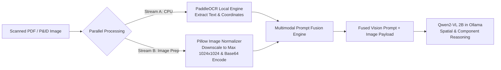

# Plan 26: Qwen2-VL Multimodal Preprocessing & Vision Pipeline Design

## 1. Objective
Design the multimodal vision pipeline combining base64 image encoding, resolution downscaling, spatial prompt formulation, and PaddleOCR text fusion to feed complex visual diagrams into the local `qwen2-vl:2b-q4_k_m` model.

## 2. Requirement Mapping
- **SIH26117 Requirement 08:** *MULTIMODAL INPUT PROCESSING* — Native support for processing scanned PDF inspection reports, handwritten field notes, and complex engineering diagrams.
- **SIH26117 Requirement 09:** *ON-DEVICE OCR & VISION* — Coupling high-precision OCR with on-device vision-language models.

## 3. Detailed Design & Technical Approach

### 3.1. Multimodal Ingestion Pipeline Architecture



### 3.2. Vision Preprocessing & Fusion (`backend/rag/vision_pipeline.py`)
```python
import base64
from io import BytesIO
from PIL import Image
from typing import Dict, Any, List
from backend.core.ollama_client import OllamaClient
from backend.tools.ocr_tool import PaddleOCRTool

class MultimodalVisionPipeline:
    def __init__(self, ollama_client: OllamaClient, ocr_tool: PaddleOCRTool):
        self.ollama = ollama_client
        self.ocr = ocr_tool

    def encode_image(self, image_path: str, max_dim: int = 1024) -> str:
        with Image.open(image_path) as img:
            img = img.convert("RGB")
            # Downscale if image exceeds max dimension to avoid KV cache explosion
            if max(img.size) > max_dim:
                img.thumbnail((max_dim, max_dim), Image.Resampling.LANCZOS)
            
            buffer = BytesIO()
            img.save(buffer, format="JPEG", quality=85)
            return base64.b64encode(buffer.getvalue()).decode("utf-8")

    async def analyze_visual_document(self, image_path: str, query: str) -> Dict[str, Any]:
        # 1. Run local PaddleOCR
        ocr_result = await self.ocr._run(file_path=image_path)
        extracted_text = ocr_result.get("raw_text", "")

        # 2. Encode image for Qwen2-VL
        base64_img = self.encode_image(image_path)

        # 3. Formulate fused spatial prompt
        fused_prompt = (
            f"Analyze this industrial engineering diagram / inspection document.\n"
            f"Extracted OCR Text:\n{extracted_text}\n\n"
            f"User Question: {query}\n"
            f"Identify all relevant equipment components, tag numbers, and measurements accurately."
        )

        # 4. Invoke local Qwen2-VL 2B
        response_chunks = []
        async for chunk in self.ollama.generate_stream(
            model="qwen2-vl:2b-q4_k_m",
            prompt=fused_prompt,
            images=[base64_img]
        ):
            response_chunks.append(chunk)

        analysis = "".join(response_chunks)
        return {
            "status": "SUCCESS",
            "ocr_text": extracted_text,
            "vlm_analysis": analysis
        }
```

## 4. Inputs / Outputs & Contracts
- **Input:** Image path, user question.
- **Output:** Joint multimodal synthesis combining raw OCR tokens with VLM spatial context.

## 5. Dependencies on Other Plan Files
- Depends on: [Plan 07](file:///G:/SIH/p/docs/plans/07_ollama_integration.md), [Plan 24](file:///G:/SIH/p/docs/plans/24_paddleocr_integration.md).
- Depended on by: [Plan 27](file:///G:/SIH/p/docs/plans/27_pid_drawing_analysis.md), [Plan 28](file:///G:/SIH/p/docs/plans/28_handwritten_notes_extraction.md), [Plan 49](file:///G:/SIH/p/docs/plans/49_demo_scenarios_e2e.md).

## 6. Edge Cases & Failure Modes
- **High-Resolution 4K Engineering Drawings:** Image downscaling to 1024px preserves overall layout while PaddleOCR captures fine-grained text tokens, avoiding VRAM blowup in Qwen2-VL.

## 7. Acceptance Criteria & Verification
- Vision pipeline processes sample P&ID image and returns tag numbers and component types in under 3.5 seconds.
- Memory during vision inference stays strictly within the 2.0 GB allocated model budget.

## 8. Design Decisions & Open Questions
- **DESIGN DECISION — reasoning:** Dual-stream fusion (PaddleOCR + Qwen2-VL) overcomes the known limitation of small 2B vision models on tiny alphanumeric tag text by feeding high-precision OCR text into the VLM prompt.
