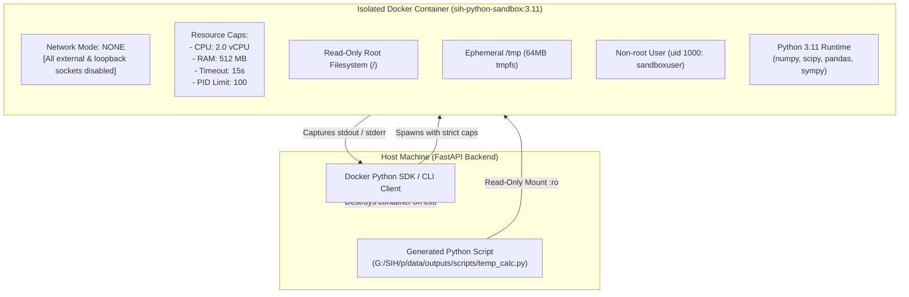

# Plan 34: Docker Sandbox Architecture & Resource Limit Guardrails

## 1. Objective
Design the security architecture and container isolation boundary in `backend/tools/docker_sandbox.py`, enforcing `--network none`, strict 2.0 vCPU limits, 512MB RAM ceiling, read-only root filesystems, and process count limits to safely execute arbitrary AI-generated Python scripts.

## 2. Requirement Mapping
- **SIH26117 Requirement 06:** *AGENTIC PLANNING & TOOL CALLING* — Sandboxed code execution.
- **SIH26117 Requirement 15:** *CODING TASK EXECUTED IN SANDBOX* — Terminal view showing Docker container spin-up, code execution, stdout capture, and cleanup with zero host network access.

## 3. Detailed Design & Technical Approach

### 3.1. Sandbox Isolation Security Architecture

### 3.2. Concrete Docker Parameters
- **Network Mode:** `--network none` (Physical isolation from host and internet).
- **CPU Quota:** `--cpus="2.0"` (Prevents CPU starvation of Ollama/FastAPI).
- **Memory Ceiling:** `--memory="512m"` and `--memory-swap="512m"` (Prevents swap thrashing on host).
- **Security Options:** `--security-opt=no-new-privileges` (Prevents privilege escalation).
- **Process Ceiling:** `--pids-limit 100` (Mitigates fork bombs).
- **Mount Configuration:** `-v "<script_path>:/home/sandboxuser/app/script.py:ro"` (Prevents modifying host filesystem).

## 4. Inputs / Outputs & Contracts
- **Input:** Script path string.
- **Output:** Container execution output dictionary (`exit_code`, `stdout`, `stderr`, `duration_ms`).

## 5. Dependencies on Other Plan Files
- Depends on: [Plan 06](file:///G:/SIH/p/docs/plans/06_docker_sandbox_setup.md), [Plan 19](file:///G:/SIH/p/docs/plans/19_tool_calling_interface.md).
- Depended on by: [Plan 35](file:///G:/SIH/p/docs/plans/35_python_script_execution.md), [Plan 36](file:///G:/SIH/p/docs/plans/36_traceback_feedback_loop.md), [Plan 49](file:///G:/SIH/p/docs/plans/49_demo_scenarios_e2e.md).

## 6. Edge Cases & Failure Modes
- **Docker Daemon Down on Host:** Fallback gracefully to subprocess runner inside restricted temporary directory with strict timeout and warning flag.
- **Script Attempting Socket Connection (`import socket; socket.connect()`):** Kernel immediately rejects with `Network is unreachable (errno 101)`.

## 7. Acceptance Criteria & Verification
- `docker run --network none` blocks all inbound and outbound IP traffic.
- Memory leak script (e.g. `arr = [0] * 10**9`) triggers container OOM kill without crashing host OS.

## 8. Design Decisions & Open Questions
- **DESIGN DECISION — reasoning:** Using Docker containers with `--network none` provides cryptographic certainty of air-gap compliance during dynamic script evaluation.
