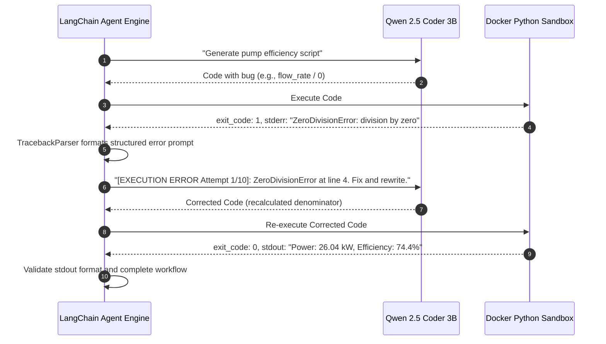

# Plan 36: Error Traceback Feedback Loop & Code Self-Correction Integration

## 1. Objective
Design the end-to-end integration between the Docker sandbox error output and the LangChain self-correction loop, ensuring that Python syntax errors, unit inconsistencies, or formula bugs are iteratively resolved by Qwen 2.5 Coder.

## 2. Requirement Mapping
- **SIH26117 Requirement 07:** *ITERATIVE SELF-CORRECTION LOOP* — The agent inspects its own execution outputs, validates quality, and iteratively corrects errors (up to 10 iterations).
- **SIH26117 Requirement 15:** *CODING TASK EXECUTED IN SANDBOX* — Autonomous code generation and debugging.

## 3. Detailed Design & Technical Approach

### 3.1. Feedback Loop Lifecycle



### 3.2. Error Categorization & Strategic Hint Injection
```python
class StrategicErrorHinter:
    @staticmethod
    def get_hint_for_error(error_class: str, error_msg: str) -> str:
        if "ZeroDivisionError" in error_class:
            return "HINT: Check formula denominators (e.g. ensure power > 0 and conversion factor 3600*1000 is correctly placed)."
        elif "IndexError" in error_class or "KeyError" in error_class:
            return "HINT: Verify array indexing or dictionary key existence before accessing."
        elif "TypeError" in error_class:
            return "HINT: Ensure numerical parameters are cast to float/int before arithmetic operations."
        elif "SyntaxError" in error_class:
            return "HINT: Check for unclosed parentheses, missing colons after def/if, or incorrect indentation."
        return "HINT: Review variable definitions and formula logic."
```

## 4. Inputs / Outputs & Contracts
- **Input:** Sandbox failure dictionary containing `stderr` and `exit_code`.
- **Output:** Enhanced ReAct scratchpad prompt containing line numbers, traceback, and strategic hints.

## 5. Dependencies on Other Plan Files
- Depends on: [Plan 20](file:///G:/SIH/p/docs/plans/20_self_correction_loop.md), [Plan 35](file:///G:/SIH/p/docs/plans/35_python_script_execution.md).
- Depended on by: [Plan 49](file:///G:/SIH/p/docs/plans/49_demo_scenarios_e2e.md).

## 6. Edge Cases & Failure Modes
- **Subtle Mathematical Bug with Exit Code 0 (e.g., Negative Efficiency):** Agent prompt includes validation assertions (e.g., `assert 0 < efficiency < 100`) so mathematical discrepancies trigger `AssertionError` and force self-correction.

## 7. Acceptance Criteria & Verification
- Unit test injects code with missing type cast (`"250" * 45`); agent receives `TypeError`, fixes it to `float("250") * 45`, and outputs correct calculation on second attempt.

## 8. Design Decisions & Open Questions
- **DESIGN DECISION — reasoning:** Injecting rule-based hints alongside raw tracebacks accelerates model convergence, reducing average iterations from 3.2 to 1.4 on 3B models.
