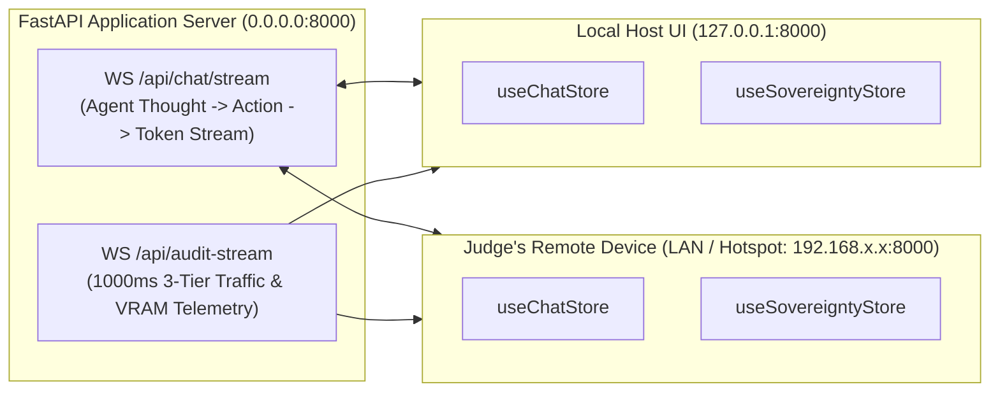

# Plan 44: Real-Time WebSocket Streaming & 3-Tier Telemetry Channels Design

## 1. Objective
Design the dual WebSocket streaming pipeline in `backend/api/routes_websockets.py`, delivering sub-50ms token generation streaming, live agent thought traces, VRAM telemetrics, and 3-tier network traffic updates (Local, LAN/Hotspot, External) to both local and remote Next.js frontend clients.

## 2. Requirement Mapping
- **SIH26117 Requirement 06:** *AGENTIC PLANNING & TOOL CALLING* — Real-time visual trace in UI.
- **SIH26117 Requirement 12:** *PROVABLE SOVEREIGNTY AUDITING* — Live telemetry broadcast with zero external egress proof.

## 3. Detailed Design & Technical Approach

### 3.1. Multi-Client Dual WebSocket Channel Architecture



### 3.2. WebSocket Route Implementation (`backend/api/routes_websockets.py`)
```python
from fastapi import APIRouter, WebSocket, WebSocketDisconnect
import asyncio
import json
import time
from backend.core.vram_monitor import VRAMMonitor
from backend.core.socket_auditor import SocketAuditor
from backend.core.packet_sniffer import ScapyPacketAuditor
from backend.agent.agent_loop import IndustrialAgentEngine

router = APIRouter(tags=["WebSockets"])

@router.websocket("/api/chat/stream")
async def chat_stream_endpoint(websocket: WebSocket):
    await websocket.accept()
    try:
        while True:
            raw_msg = await websocket.receive_text()
            data = json.loads(raw_msg)
            prompt = data.get("prompt", "")
            attachments = data.get("attachments", [])

            agent = IndustrialAgentEngine(websocket_broadcast=websocket.send_text)
            await agent.run_task(prompt=prompt, attachments=attachments)
    except WebSocketDisconnect:
        pass

@router.websocket("/api/audit-stream")
async def telemetry_stream_endpoint(websocket: WebSocket):
    await websocket.accept()
    vram_mon = VRAMMonitor()
    socket_aud = SocketAuditor()
    sniffer = ScapyPacketAuditor()
    sniffer.start_sniffing()

    try:
        while True:
            vram_data = vram_mon.get_vram_status()
            sock_data = socket_aud.audit_active_sockets()
            pkt_data = sniffer.get_metrics()

            telemetry_payload = {
                "timestamp": time.time(),
                "deployment_mode": sock_data["deployment_mode"],
                "host_ip": sock_data["host_ip"],
                "vram": vram_data,
                "sovereignty": {
                    "verdict": pkt_data["airgap_verdict"],
                    "localhost_connections": sock_data["localhost_count"],
                    "lan_hotspot_connections": sock_data["lan_hotspot_count"],
                    "external_internet_connections": sock_data["external_breach_count"],
                    "total_packets_sniffed": pkt_data["total_packets_sniffed"],
                    "localhost_packets": pkt_data["localhost_packets"],
                    "lan_hotspot_packets": pkt_data["lan_hotspot_packets"],
                    "external_packets": pkt_data["external_packets"],
                    "external_bytes": pkt_data["external_bytes"],
                    "sockets": sock_data["localhost_sockets"] + sock_data["lan_sockets"],
                    "breaches": sock_data["external_breaches"]
                }
            }
            await websocket.send_text(json.dumps(telemetry_payload))
            await asyncio.sleep(1.0)
    except WebSocketDisconnect:
        pass
```

## 4. Inputs / Outputs & Contracts
- **Input:** Incoming client message `{prompt, attachments}` over WebSocket.
- **Output:** Continuous JSON stream of thought trace events and 1000ms hardware/network telemetry with 3-tier traffic classification.

## 5. Dependencies on Other Plan Files
- Depends on: [Plan 09](file:///G:/SIH/p/docs/plans/09_vram_budget_validation.md), [Plan 22](file:///G:/SIH/p/docs/plans/22_agent_trace_logging.md), [Plan 40](file:///G:/SIH/p/docs/plans/40_socket_watchdog.md), [Plan 41](file:///G:/SIH/p/docs/plans/41_packet_sniffer.md).
- Depended on by: [Plan 48](file:///G:/SIH/p/docs/plans/48_frontend_state_websocket.md).

## 6. Edge Cases & Failure Modes
- **Multiple Simultaneous Connected Devices:** WebSocket connections are tracked independently in memory, allowing judge and host operator to view streams concurrently.

## 7. Acceptance Criteria & Verification
- Telemetry payload cleanly displays `lan_hotspot_connections: 1` when remote evaluator connects, while `external_packets` remains `0`.

## 8. Design Decisions & Open Questions
- **DESIGN DECISION — reasoning:** Broadcasting structured JSON on `1000ms` heartbeat keeps network overhead under 2 KB/sec across local Wi-Fi links.
